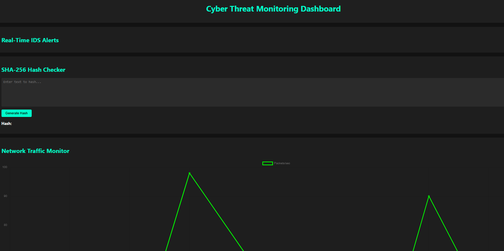
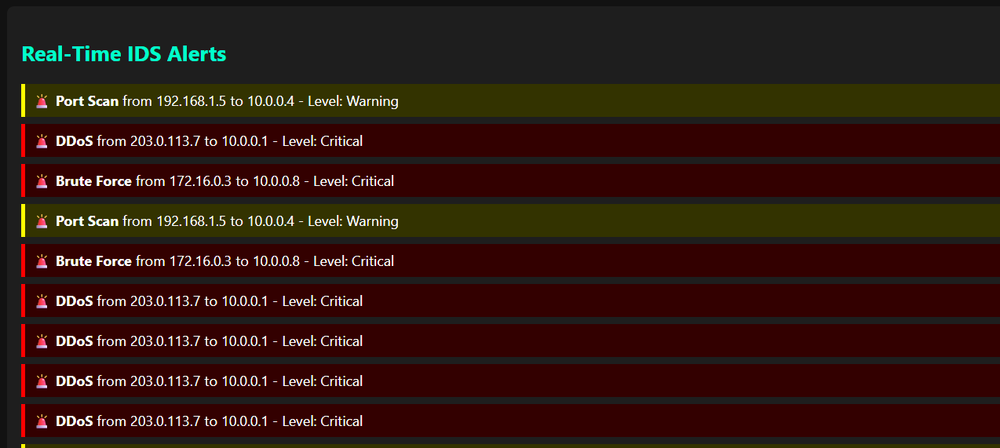
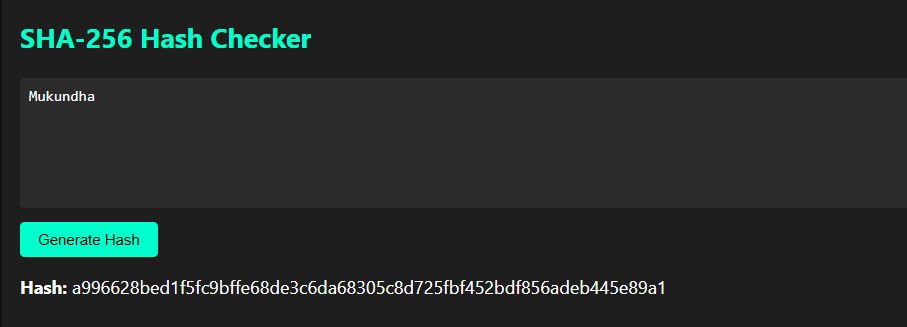
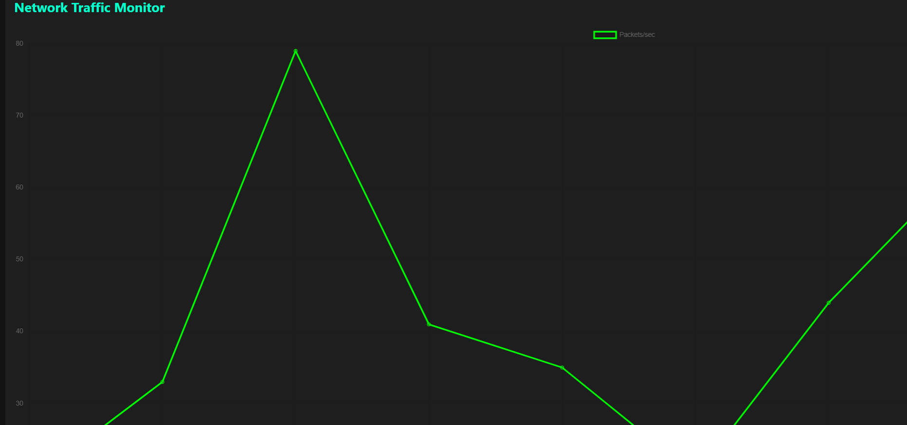
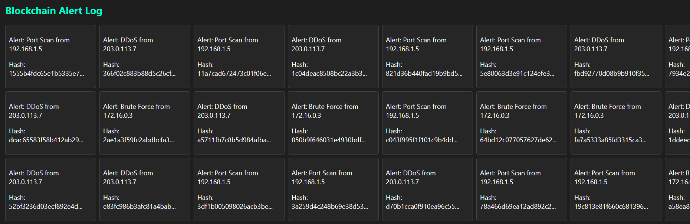

# Cyber Dashboard

A single-page JavaScript web application that simulates a real-time cybersecurity monitoring dashboard.  

This project demonstrates fundamental cybersecurity visualization concepts such as intrusion detection system (IDS) alerts, network traffic visualization, blockchain-inspired alert logging, cryptographic hashing, and time synchronization — all using simulated/sample data for educational and demonstrative purposes.

---

## Table of Contents

- [Overview](#overview)  
- [Features](#features)  
- [Technologies Used](#technologies-used)  
- [Project Structure](#project-structure)  
- [Installation](#installation)  
- [Usage](#usage)  
- [How It Works](#how-it-works)  
- [Screenshots](#screenshots)  
- [Limitations](#limitations)  
- [Contributing](#contributing)  
- [Changelog](#changelog)  
- [FAQ](#faq)  
- [Roadmap](#roadmap)  
- [License](#license)  
- [Contact](#contact)  

---

## Overview

Cyber Dashboard is a frontend-only simulation of a cybersecurity monitoring dashboard designed with Reactivity and Visual Clarity as priorities. It runs entirely in the browser without any backend or server-side code.

The dashboard mimics common security monitoring components:

- Alerts from an IDS (intrusion detection system),
- A cryptographic hash generator,
- Network traffic charting,
- A simplified blockchain-inspired alert log,
- Current time synchronization.

Ideal for learners of JavaScript, cybersecurity concepts, and developer projects that wish to visualize data flows without real backend feeds.

---

## Features

### Real-Time IDS Alerts

- Simulates incoming IDS alerts with randomized data every **4 seconds**.
- Alerts include fields such as source IP, destination IP, alert type (e.g., Port Scan, Malware), and severity level (Warning or Critical).
- Alerts are displayed in a scrollable list with visual distinctions based on severity using color coding.

### SHA-256 Hash Generator

- Allows user input via a text field.
- Uses the Web Crypto API to asynchronously compute SHA-256 hashes.
- Displays hash output in hexadecimal format.
- Demonstrates cryptographic hashing practices in frontend JavaScript.

### Live Network Traffic Chart

- Uses [Chart.js](https://www.chartjs.org/) library to render a real-time line chart showing packets per second.
- Updates every **2 seconds** with randomized traffic data.
- Visually simulates network traffic fluctuations.

### Blockchain Alert Log

- Maintains an array representing a simplified blockchain.
- Each new alert acts as a “block” containing:
  - alert text,
  - previous block’s hash,
  - current block’s own SHA-256 hash.
- Visualizes the chain in the UI with individual block elements.
- Adds a new block every **7 seconds** to simulate chaining of alert data.

### Time Synchronizer

- Displays the current local time.
- Updates every second to simulate system time synchronization.

### Dark Mode UI

- Clean, modern, and responsive user interface.
- Dark theme with contrast colors for enhanced readability (accent color: #00ffcc).
- Uses CSS Grid for layout and Flexbox for blockchain elements.
- Includes button, alert, textarea, and block styling to make the interface intuitive and visually appealing.

---

## Technologies Used

- **JavaScript (ES6+):** Vanilla JavaScript used for all logic and DOM manipulation.  
- **Web Crypto API:** Native browser API providing cryptographic functionality for hashing.  
- **Chart.js:** Open-source JavaScript charting for rendering network traffic charts dynamically.  
- **HTML5 & CSS3:** Semantic HTML coupled with modern CSS features including Grid and Flexbox.  
- **Git & GitHub:** Version control and hosting platform.

---

---

## Installation

1. Clone the repository:
2. Open `index.html` directly in your preferred modern web browser (Chrome, Firefox, Edge, Safari).
3. (Optional) Serve locally with a simple HTTP server for better file access consistency:

Then open [http://localhost:8000](http://localhost:8000) in your browser.

---

## Usage

- **Simulated Alerts:** Watch IDS alerts appear every 4 seconds with changing contents and severities.  
- **Hash Generator:** Type text in the input box and click the hash button to view the SHA-256 hash result instantly.  
- **Network Chart:** Observe the network traffic graph updating every 2 seconds with varying packets/sec numbers.  
- **Blockchain Log:** Every 7 seconds, new alert blocks are appended to the blockchain alert log with cryptographic linkage.  
- **Time Display:** See the current local time updating every second.

---

## How It Works

### Real-Time Alerts

- The script sets a timer to select random alert objects from a predefined array.
- Each selected alert is prepended to the alert display panel.
- Alerts have classes controlling the styles based on severity.

### SHA-256 Hashing

- The input string is converted into a Uint8Array.
- The Web Crypto API’s `crypto.subtle.digest()` asynchronously hashes the input.
- The buffer result is converted to a hex string and displayed.

### Network Traffic Charting

- Chart.js initializes a line chart with initial random data.
- A timer updates the chart dataset every 2 seconds with new random traffic data.
- The chart automatically re-renders with the latest data for smooth user experience.

### Blockchain Simulation

- Blocks are JavaScript objects containing alert text, previous block hash, and own hash.
- A blockchain array stores these blocks in order.
- Each new block references the hash of the previous, maintaining chain consistency.
- Blocks are displayed in the UI with hash values for visualization.

### Time Synchronization

- A JavaScript timer updates a clock element every second.
- Shows user’s machine local current time as a simulation of synced system time.

---

## Screenshots

## Screenshots

Here’s what the dashboard and its main components look like:

---

## Limitations

- **Simulated Data Only:** No live or real network data integration.  
- **No Backend:** All processing is client-side, with no persistence or multi-user support.  
- **No Authentication:** No user login, access control, or sensitive data handling.  
- **Educational Purpose:** Not suitable for deployment in production cybersecurity monitoring.

---

## Contributing

Contributions are warmly welcome!

- **Bug Reports:** Use GitHub issues to report bugs or request features.  
- **Pull Requests:** Fork the repo, create feature branches, and submit PRs with clear commit messages.  
- **Coding Style:** Follow descriptive commit messages (imperative mood), keep functions modular, and write clear inline comments for new features or fixes.  
- **Enhancements:** Ideas include connecting to real IDS data, adding user roles, improving UI/UX, or adding persistent storage.

---

## Changelog

### v1.0.0 (2025-07-26)

- Initial release of Cyber Dashboard project.  
- Implemented simulated IDS alerts, hash generator, network traffic chart, blockchain alert log, and time synchronization features.  
- Developed responsive dark mode UI.  
- Used vanilla JavaScript, Chart.js, and the Web Crypto API.

*(Add future versions here)*

---

## FAQ

**Q: Does this project work without internet?**  
A: Yes, all code and dependencies are local and run entirely in the browser.

**Q: Can I connect this dashboard to my real IDS?**  
A: Currently no, but you can modify the script to fetch real data from your backend or APIs.

**Q: Is my input to the hash generator sent anywhere?**  
A: No, hashing is done fully client-side without any network requests.

**Q: How can I add new alert types?**  
A: Edit the alerts array in `script.js` to include new alert objects with desired properties.

---

## Roadmap

Planned future improvements:

- Add option to connect dashboard to real IDS via API integration.  
- Implement user authentication and role-based views.  
- Persist blockchain alert log in browser storage or backend database.  
- Add alert filtering and search capabilities.  
- Improve UI accessibility and responsiveness.  
- Add theme switching between dark and light modes.  
- Provide downloadable reports or alert export.

---

## License

This project is licensed under the [MIT License](LICENSE). Feel free to use, modify, and distribute freely.

---

## Contact

Your Name — [mukundhasuresh@gmail.com](mailto:mukundhasuresh@gmail.com)  
GitHub: [https://github.com/mukundhasuresh](https://github.com/mukundhasuresh)  

---

Thank you for exploring the Cyber Dashboard project! Feel free to raise issues, submit PRs, or reach out with questions and suggestions.

